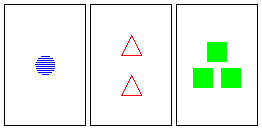

Tau Game
========

This is Tau: http://taugame.com/

Tau is an online multiplayer card game. The game is pure web application -- no plugins or applets are required.

How to Play
-----------

Each card has four properties (color, number, shape, fill), and each property has three choices. The choices are:
  * Color: red, blue, green
  * Number: one, two, three
  * Shape: triangle, square, circle
  * Fill: clear, shaded, solid

There exists exactly one card for every unique combination of properties. Thus, there are 81 = 3^4 cards in a deck.

The objective of the game is to find taus. A tau is a set of three cards such that for each property, the values of the property for the three cards are either all the same or all different. For example, if a tau contains two cards of the same color, the third card must also be the same color. If a tau contains two cards of different numbers, the third card must have a number different from the other two cards. It is possible to have taus where there are one, two, three, or four properties that are all different, and the rest common. However, there is no tau where no properties are different and all four properties are common, since every card is unique.

Here is an example of a tau where all four properties are all different:

